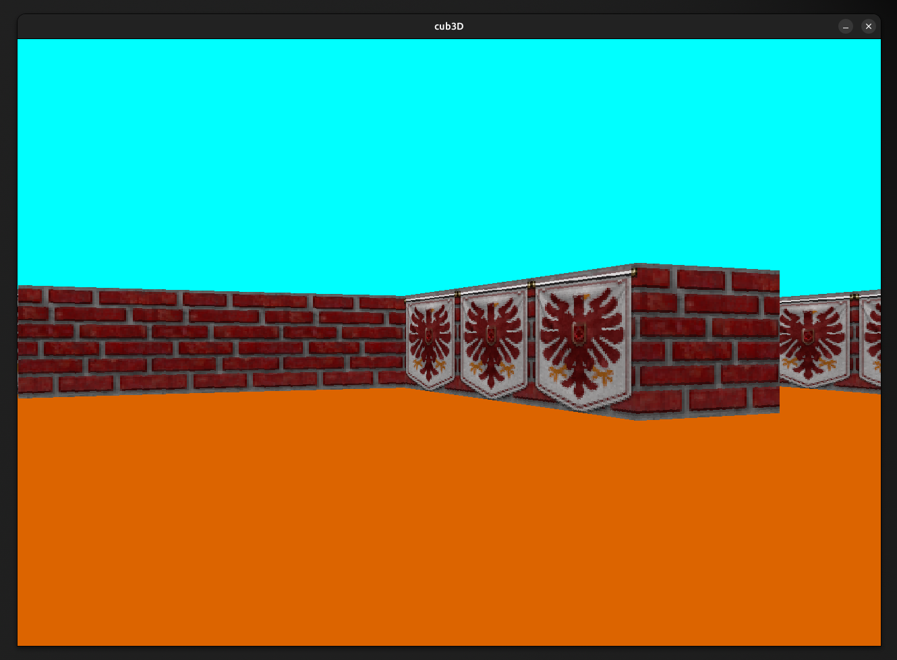
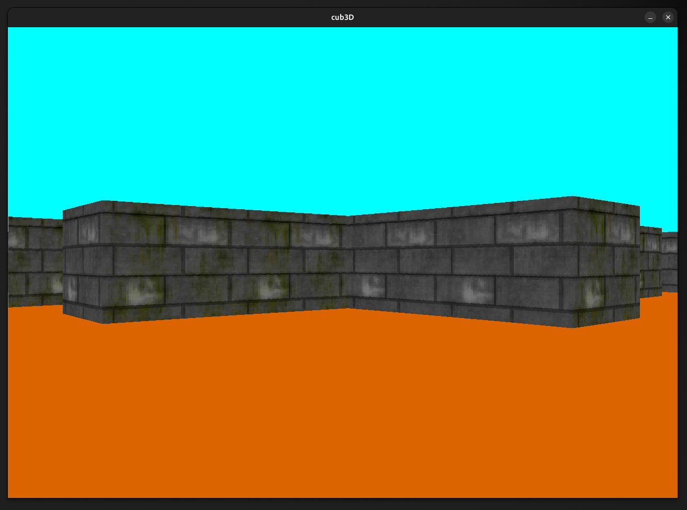

# cub3D



This project was done in collaboration with [gmarchal](https://github.com/gmarchale).

## Description

`cub3D` is a project that implements a simple 3D game engine using the raycasting technique, inspired by the classic game Wolfenstein 3D. This engine is built using the MinilibX graphical library and supports basic textures, player movement, and collision detection.

---

## Features
- **Raycasting Rendering**: Real-time rendering of a 3D environment from a 2D map.
- **Textures**: Walls are rendered with customizable textures for each cardinal direction.
- **Player Movement**: Navigate the map with smooth movements.
- **Customizable Maps**: Create your own maps using a `.cub` file format.
- **Color Background**: Support for floor and ceiling color customization.

---


## Requirements
- MinilibX library (Linux version or macOS version, depending on the OS)
- OpenGL and X11 libraries (Linux) or Metal framework (macOS)

---

### Map



The map is defined using the following characters:
- `1`: Wall
- `0`: Empty space
- `S`, `N`, `E`, `W`: Player starting position, also indicating the player's initial facing direction.

**Rules**:
- The map must be enclosed by walls (`1`).
- Player starting position (`S`, `N`, `E`, `W`) must be unique.

---

## Map Format

The game maps must be defined in a `.cub` file. Below is the explanation of the format:

### Header
1. **Textures**:
   - `NO`: Path to the texture for the north-facing walls.
   - `SO`: Path to the texture for the south-facing walls.
   - `WE`: Path to the texture for the west-facing walls.
   - `EA`: Path to the texture for the east-facing walls.

   Example:
   ```
   NO ./texture/banner_redbrick.xpm
   SO ./texture/brick_gray.xpm
   WE ./texture/brick_red.xpm
   EA ./texture/brick_graymoss.xpm
   ```

2. **Colors**:
   - `F`: RGB color for the floor (e.g., `220,100,0` for orange).
   - `C`: RGB color for the ceiling (e.g., `0,255,255` for cyan).

   Example:
   ```
   F 220,100,0
   C 0,255,255
   ```

---

### Example Map File (`testmap.cub`)

```
NO ./texture/banner_redbrick.xpm
WE ./texture/brick_red.xpm
SO ./texture/brick_gray.xpm
EA ./texture/brick_graymoss.xpm

F 220,100,0
C 0,255,255

111111111111111
100000000000101
100001000000101
111100000010101
100000000010101
1000000S1111101
100000000000001
100000000000001
111111000111101
100000000000001
111111111111111
```

---

## Controls

- **W/A/S/D**: Move forward, left, backward, or right.
- **Arrow Keys**: Rotate the player's view.
- **ESC**: Exit the game.
